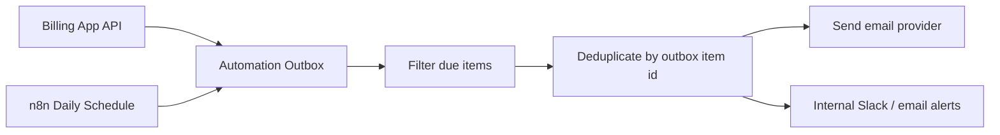

# Billing Automation

This workbook now exposes a hosted-ready billing automation outbox that turns partner billing terms into a queue of invoice-send actions, payment reminders, late-fee notices, and internal ops warnings.

## Current Capability

The billing API now exposes:

- `GET /api/automation/outbox`

Example:

```text
GET /api/automation/outbox?asOf=2026-04-08&lookaheadDays=45
```

Response includes:

- `items`: invoice and reminder actions to send
- `issues`: missing configuration that blocks automation
- `summary`: queue totals

Each outbox item already contains:

- partner
- billing period
- recipients
- subject
- bodyText
- amountDue
- balance
- dueDate
- invoiceDraftUrl
- late fee settings

So the email automation layer does not need to calculate billing logic again. It only needs to:

1. fetch the outbox
2. send the due items
3. avoid duplicates

## Fields That Drive Automation

Automation uses the partner billing fields in `Billing & Invoice Tracking`:

- `contactEmails`
- `billingDay`
- `payBy`
- `dueDays`
- `lateFeePercentMonthly`
- `lateFeeStartDays`
- `serviceSuspensionDays`
- `lateFeeTerms`

## What The Outbox Currently Schedules

- `invoice_prep`
  - internal reminder before an expected invoice send date
- `invoice_send`
  - partner invoice email
- `payment_reminder_due_soon`
  - reminder before due date
- `payment_reminder_due_today`
  - reminder on due date
- `payment_reminder_overdue`
  - reminder after due date
- `late_fee_notice`
  - notify that late-fee terms now apply
- `service_suspension_warning`
  - internal ops warning

## Current Guardrails

The queue is intentionally conservative:

- fully paid invoice periods do not generate email actions
- ancient missed invoice-prep/send items are suppressed
- quarterly partners are treated as manual-schedule unless a real `invoiceDate` is entered
- missing emails / billing day / due terms appear in `issues`

## Recommended Production Architecture

Best setup once hosted:



### Why n8n is the best fit

- billing logic stays in the billing app
- email credentials stay outside the app
- reminders can be scheduled daily without changing app logic
- provider can be SMTP, Gmail, SendGrid, Mailgun, or an internal mail API

## Recommended n8n Workflow

1. Daily `Schedule Trigger`
2. `HTTP Request` to `GET /api/automation/outbox`
3. Filter to:
   - partner-facing items with `status = due_today` or `status = overdue`
   - internal items with `status = due_today` or `status = overdue`
4. Check a dedupe store keyed by `item.id`
5. If not already sent:
   - send the email using `subject`, `bodyText`, `recipients`
   - optionally fetch `invoiceDraftUrl` and attach/render the invoice
   - mark that `item.id` as sent in n8n Data Store
6. Create internal alerts for entries in `issues`

## Dedupe Rules

Use `item.id` as the send key.

This is important because:

- invoice sends should happen once per scheduled send action
- due-soon reminders should happen once per reminder date
- overdue reminders should happen once per configured threshold

Recommended storage:

- n8n Data Store
- or your hosted database if engineering prefers central storage

## Invoice Attachments

Current outbox items include `invoiceDraftUrl`.

When hosted, the cleanest pattern is:

1. fetch `invoiceDraftUrl`
2. render/transform to PDF
3. attach to the `invoice_send` email

If PDF generation is not ready yet, the workflow can still:

- send the invoice email body
- include the hosted invoice link

## Manual-Handling Cases

These should not be auto-sent until configured:

- missing `contactEmails`
- missing `billingDay`
- missing `dueDays` / `payBy`
- quarterly contracts without a manually entered `invoiceDate`

These appear in the outbox `issues` list.

## Late Fees

Late fees are only scheduled when:

- `lateFeePercentMonthly > 0`
- `lateFeeStartDays > 0`

If a contract has text in `lateFeeTerms` but no configured percent/rule, the outbox raises an issue instead of guessing.

## Current Limitation While Local

The automation engine works locally, but actual email sending should wait for hosting because:

- local URLs are not reachable by cloud automation
- email provider credentials should not live in the browser
- invoice links/attachments should come from a hosted API

## Launch Checklist

Before turning on automatic sends in production:

- host the billing API
- confirm partner contact emails
- confirm billing day and due terms per partner
- confirm late fee settings per contract
- connect n8n to the hosted API
- configure email provider credentials
- enable dedupe storage
- test with a staging partner first
