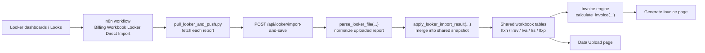
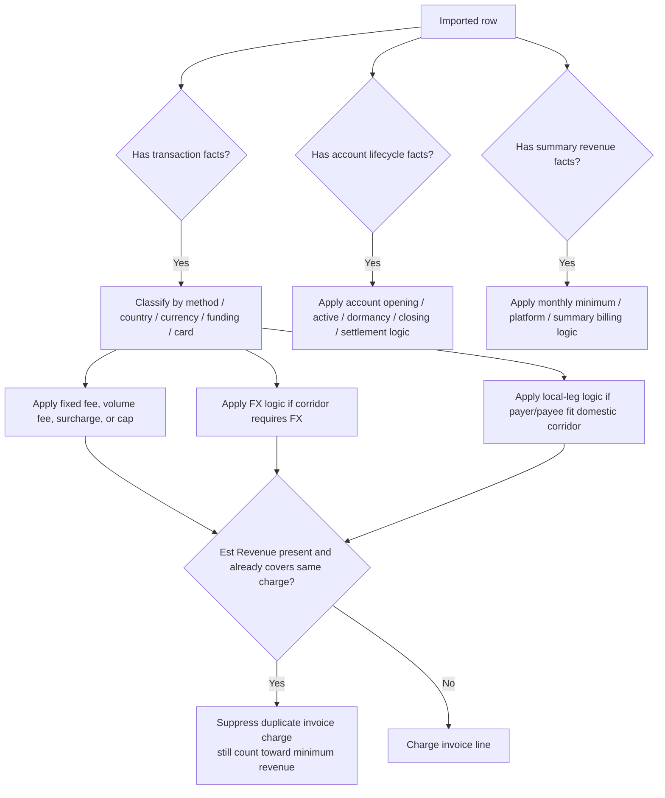

# Looker Report Engineering Data Flow

## Purpose

This document shows the exact data flow from Looker into the billing workbook, which report feeds which app table, and which field families are required for each billing function.

It is meant for the engineer creating or updating the Looker reports.

Companion field-level specs:

- `/Users/danielsinukoff/Documents/billing-workbook/reports/data_requirements/billing_data_requirements_spec.xlsx`
- `/Users/danielsinukoff/Documents/billing-workbook/reports/data_requirements/billing_data_requirements_engineering_handoff.xlsx`

## End-To-End Flow

## Report-To-Table Mapping

```mermaid
flowchart TD
    subgraph Looker_Reports["Looker Reports"]
        R1["Partner Offline Billing"]
        R2["Partner Offline Billing (Reversals)"]
        R3["All Registered Accounts"]
        R4["Partner Revenue Summary"]
        R5["Partner Rev Share V2"]
        R6["Partner Revenue Share"]
        R7["Partner Revenue Reversal"]
        R8["Stampli FX Revenue Share"]
        R9["Stampli FX Revenue Reversal"]
    end

    R1 --> T1["ltxn<br/>transaction aggregates"]
    R2 --> T2["lrev<br/>reversal aggregates"]
    R3 --> T3["lva<br/>virtual account usage"]
    R4 --> T4["lrs<br/>revenue summary rows"]
    R5 --> T4
    R6 --> T4
    R7 --> T4
    R8 --> T5["lfxp<br/>Stampli FX payout rows"]
    R9 --> T5

    T1 --> F1["Fixed per-txn fees"]
    T1 --> F2["Volume-based fees"]
    T1 --> F3["Fee caps"]
    T1 --> F4["Surcharges"]
    T1 --> F5["Local payment leg logic"]
    T1 --> F6["SWIFT / USD abroad logic"]
    T1 --> F7["Est Revenue double-charge protection"]
    T1 --> F8["Minimum revenue support"]

    T2 --> F9["Reversal fees"]

    T3 --> F10["Account opening fees"]
    T3 --> F11["Monthly active account fees"]
    T3 --> F12["Dormancy fees"]
    T3 --> F13["Account closing fees"]
    T3 --> F14["Year-end account setup fees"]
    T3 --> F15["Daily settlement fees"]

    T4 --> F16["Minimum monthly revenue commitment"]
    T4 --> F17["Platform / subscription / summary billing"]
    T4 --> F18["Revenue share payout / receivable support"]

    T5 --> F19["Stampli FX AP payout"]
    T5 --> F20["Stampli FX reversal adjustment"]
```

## Current Direct Report Config

These are the currently configured direct reports in:

- `/Users/danielsinukoff/Documents/billing-workbook/docs/looker-direct-reports.json`

| File Type | Looker Source | Current Purpose |
| --- | --- | --- |
| `partner_revenue_summary` | Look `6836` | Summary-based revenue, monthly minimum, recurring billing support |
| `partner_offline_billing` | Dashboard `1009`, Tile `9356` | Payment-level billing facts for transaction, volume, FX, local leg, SWIFT, surcharge, and est revenue |
| `partner_offline_billing_reversals` | Dashboard `1009`, Tile `9862` | Reversal-level billing facts |
| `all_registered_accounts` | Dashboard `1009`, Tile `10414` | Virtual account and account-lifecycle usage |
| `partner_rev_share_v2` | Dashboard `942`, Tile `10500` | Revenue-share support rows |
| `partner_revenue_share` | Dashboard `942`, Tile `8343` | Revenue-share support rows |
| `partner_revenue_reversal` | Dashboard `942`, Tile `8344` | Revenue-share reversal rows |
| `stampli_fx_revenue_share` | Dashboard `1047`, Tile `9756` | Stampli FX payout support |
| `stampli_fx_revenue_reversal` | Dashboard `1047`, Tile `9757` | Stampli FX payout reversal support |

## Core Domain Date Rules

These rules are already baked into billing logic and the reports should support them directly.

| Billing Concept | Date The App Uses | Why It Matters |
| --- | --- | --- |
| Standard billing month | `Credit Complete` date | This is the month used for most transaction billing |
| Reversal month | `Refund Completed` date | Reversal fees and reversal billing month are driven from refund completion |
| Account activity | account open / active / dormant / closed dates | Required for VA, dormancy, and account setup logic |
| Settlement activity | settlement sweep date or count | Required for daily settlement fees |
| Upload freshness | `fetchedAt`, `savedAt`, plus exact current-through date if available | Needed for auditability and “data through” display |

## Required Identity Keys Across All Reports

These should be present wherever they make sense. They are the minimum keys that let the app link rows correctly and avoid duplicate or orphaned billing.

| Field | Why It Is Required |
| --- | --- |
| `partner` | Primary billing entity |
| `paymentId` | Deduping and transaction linking |
| `accountId` | VA/account billing and reconciliation |
| `period` | Billing month bucketing |
| source report name | Auditability |
| query/report run time | Auditability |

## Required Field Families By Report

### 1. Partner Offline Billing

This is the most important report. It supports most fee logic.

Required fields:

- `partner`
- `paymentId`
- `accountId`
- `period`
- `txnType`
- `processingMethod`
- `payerFunding`
- `payeeFunding`
- `payeeCardType`
- `payerCcy`
- `payeeCcy`
- `payerCountry`
- `payeeCountry`
- `submissionDateTime`
- `creditCompleteDateTime`
- `payeeAmount`
- `usdAmountDebited`
- `paymentUsdEquivalentAmount`
- `totalVolume`
- `txnCount`
- `avgTxnSize`
- `customerRevenue`
- `estRevenue`
- `directInvoiceAmount`
- `directInvoiceRate`
- `typeDefn`
- `initiatorStatus`

Billing functions supported:

- ACH / Faster ACH / local rails
- SWIFT / USD abroad
- FX fees
- RTP fee logic
- surcharge logic
- fee-cap logic
- monthly minimum revenue support
- double-charge suppression via `estRevenue`

### 2. Partner Offline Billing (Reversals)

Required fields:

- `partner`
- `paymentId`
- `period`
- `refundCompletedDateTime`
- `debitReversalDateTime`
- `payerFunding`
- `payeeCountry`
- `payerCcy`
- `payeeCcy`
- `payeeAmount`
- `paymentUsdEquivalentAmount`
- `reversalCount`

Billing functions supported:

- reversal fee rows
- reversal month attribution
- reversal-related minimum-revenue support where applicable

### 3. All Registered Accounts

Required fields:

- `partner`
- `period`
- `accountId`
- `typeDefn`
- `joinDateTime`
- `lastInboundTransactionDateTime`
- `closeDateTime`
- `newAccountsOpened`
- `totalActiveAccounts`
- `totalBusinessAccounts`
- `totalIndividualAccounts`
- `dormantAccounts`
- `closedAccounts`
- `newBusinessSetups`
- `settlementCount`

Billing functions supported:

- account opening
- monthly active
- dormancy
- account closing
- yearly account setup
- daily settlement

### 4. Partner Revenue Summary

Required fields:

- `partner`
- `period`
- `netRevenue`
- `partnerRevenueShare`
- `revenueOwed`
- `monthlyMinimumRevenue`
- `billingType`
- `summaryLabel`
- `summaryComputation`
- `summaryCount`
- `summaryUnitAmount`
- `summaryLineAmount`
- charge/pay direction flag

Billing functions supported:

- minimum monthly revenue commitment
- platform / subscription / recurring summary billing
- revenue-share support
- summarized invoice lines that do not come from raw transaction pricing

### 5. Partner Rev Share V2 / Partner Revenue Share / Partner Revenue Reversal

These feed supplemental `lrs` rows and should use the same field family as the revenue summary rows where possible.

Required fields:

- `partner`
- `period`
- `partnerRevenueShare`
- `revenueOwed`
- `netRevenue`
- `summaryLabel`
- `summaryComputation`
- charge/pay direction flag

Billing functions supported:

- revenue-share payout/receivable support
- revenue-share reversal adjustments

### 6. Stampli FX Revenue Share / Stampli FX Revenue Reversal

Required fields:

- `partner`
- `paymentId`
- `accountId`
- `period`
- `submissionDateTime`
- `creditInitiatedDateTime`
- `refundCompletedDateTime`
- `payeeCountry`
- `payeeAmount`
- `payeeAmountCurrency`
- `usdAmountDebited`
- `paymentUsdEquivalentAmount`
- `openExchangeRateUsed`
- `customerMarkupPct`
- `stampliBuyRatePct`
- `stampliMarkupPct`
- `stampliMarkupAmount`

Billing functions supported:

- Stampli FX AP payout
- Stampli FX payout reversal adjustment

## Fee Logic Decision Points The Reports Must Support

## Exact “Do Not Miss” Fields

If these are missing, the app will underbill or misclassify fee logic.

- `partner`
- `paymentId`
- `accountId`
- `period`
- `txnType`
- `processingMethod`
- `payerFunding`
- `payeeFunding`
- `payerCcy`
- `payeeCcy`
- `payerCountry`
- `payeeCountry`
- `creditCompleteDateTime`
- `refundCompletedDateTime`
- `paymentUsdEquivalentAmount`
- `txnCount`
- `totalVolume`
- `customerRevenue`
- `estRevenue`
- `revenueOwed`
- `monthlyMinimumRevenue`
- `totalBusinessAccounts`
- `totalIndividualAccounts`
- `dormantAccounts`
- `closedAccounts`
- `settlementCount`

## Engineering Notes

- Payment-level detail is strongly preferred over monthly-only aggregates.
- `Est Revenue` is required to prevent double billing when revenue was already charged in-product at transaction time.
- Country and currency must both be present to support local-leg logic correctly.
- `Credit Complete` and `Refund Completed` dates must be exposed as separate fields.
- If a report can only provide a monthly window but not an exact current-through day, the app can still bill, but the upload freshness display will be less precise.
- A successful n8n run is not enough on its own. The report also has to produce the required fields with usable values.

