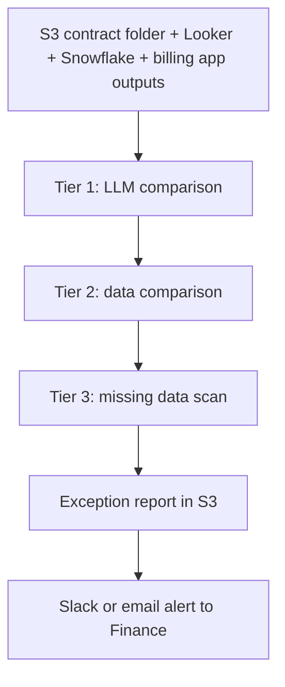

# Billing QA Workflow

This package defines the multi-tier n8n checker for billing.

The goal is to make the checker meaningfully independent from the maker app:

- the maker app produces the invoice draft
- n8n recomputes, compares, and flags exceptions
- no billing is approved until the exceptions are reviewed

## Why this is a real checker

The checker should not just read the same rendered invoice that the app shows.
It needs its own inputs and its own comparison steps:

- raw contract files from S3
- raw transaction exports from Looker and Snowflake
- maker invoice output from the billing app
- independent model parses from GPT and Claude
- a deterministic comparison step that decides pass / fail

That means the LLMs are used to parse and explain, but the final checker result still comes from explicit comparison rules and numeric reconciliation.

## Workflow tiers

### Tier 1: LLM comparison

Purpose:

- parse contract terms with GPT and Claude
- compare the parsed fee logic
- run the same transaction data against each parsed result
- compare the invoice amount from each model to the maker app output
- flag any contract terms that do not match

Primary inputs:

- contract PDFs or text files from the S3 contract folder
- last full month transaction data
- maker invoice totals from the app

Primary outputs:

- term mismatch report
- invoice amount delta report
- contract fields that need human review

### Tier 2: data comparison

Purpose:

- compare the transaction data that feeds the billing app with the same month of data from Snowflake
- flag missing rows, duplicate rows, count mismatches, and total mismatches

Primary inputs:

- Looker feed that currently lands in the billing app
- Snowflake export for the same period

Primary outputs:

- row-level mismatch report
- summary totals by partner and month
- exceptions to investigate before billing is released

### Tier 3: missing data scan

Purpose:

- find transactions that did not produce a fee because a required field or mapping was missing
- suggest the fallback or standard partner pricing rule that should have been used

Primary inputs:

- transactions with zero fee or suppressed fee
- contract terms
- known partner pricing defaults

Primary outputs:

- missing-data exception list
- suggested correction
- recommended fallback fee logic

## Recommended output format

Each checker workflow should write a structured exception report with these fields:

- `runId`
- `generatedAt`
- `period`
- `partner`
- `issueType`
- `severity`
- `makerAmount`
- `checkerAmount`
- `delta`
- `missingFields`
- `sourceRefs`
- `recommendedAction`
- `evidence`

The report can be written to S3 as JSON and CSV. If Finance wants a working surface, a Google Sheet can be added as a presentation layer, but S3 should remain the source of truth for the checker output.

## Suggested run order

1. Contract parse comparison
2. Transaction data comparison
3. Missing-data scan
4. Exception report generation
5. Finance review and approval

## Suggested cadence

- Run the LLM comparison on contract updates and before invoice approval.
- Run the data comparison after each Looker or Snowflake refresh.
- Run the missing-data scan nightly or after each import.

## Starter workflow files

- `llm-comparison.workflow.json`
- `data-comparison.workflow.json`
- `missing-data.workflow.json`

## Implementation note

These exports are starter chains. They define the run context, output shape, and control flow.
Engineering still needs to wire the actual n8n nodes for:

- S3 file listing or S3 manifest lookup
- GPT and Claude model calls
- Snowflake reads
- report upload to S3
- Slack or email alerting

The important part is that the checker remains independent from the maker and fails closed whenever a source, term, or amount does not line up.
